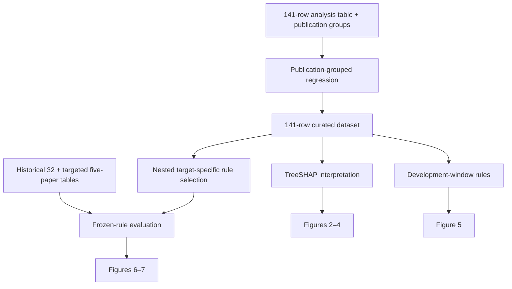

# Manuscript analysis map

## Tables

| Item | Data / supplied output | Reproduction script |
|---|---|---|
| Table 1 — equal-budget grouped model comparison | `results/grouped_cv/publication_grouped_model_summary.csv`, `publication_grouped_fold_metrics.csv` | `scripts/publication_grouped_analysis.py` |
| Table 2 — development-set descriptor windows | `results/development_windows/development_window_metrics.csv`, `development_window_bounds.json` | `scripts/development_window_rules.py` |
| Table 3 — 32-record historical audit | `data/processed/historical_audit_32.csv` | Directly distributed as the auditable row-level table |
| Table 4 — historical audit metrics and strata | `results/literature_audits/external_stratified_metrics.csv` | `scripts/historical_audit_metrics.py` |
| Table 5 — repeated publication-grouped nested rule selection | `results/rule_reassessment/nested_rule_comparison_summary.csv` | `scripts/nested_rule_selection.py` |
| Table 6 — historical and targeted stress-test comparison | `results/rule_reassessment/external_v1_v2_metrics.csv` | `scripts/evaluate_frozen_rules.py` |

## Figures

| Item | Supplied file | Reproduction / status |
|---|---|---|
| Figure 1 — concept and workflow | `figures/Fig1.png` | Editorial schematic; it contains no fitted metric. Dataset counts are independently checked by `verify_package.py`. |
| Figure 2 — effect of publication-aware validation | `figures/Fig2.png` | `scripts/final_interpretation_and_figures.py` |
| Figure 3 — grouped OOF prediction | `figures/Fig3.png` | `scripts/final_interpretation_and_figures.py` |
| Figure 4 — full-data TreeSHAP interpretation | `figures/Fig4.png` | `scripts/final_interpretation_and_figures.py` |
| Figure 5 — development-set descriptor windows | `figures/Fig5.png` | `scripts/development_window_rules.py` regenerates the data and equivalent four-panel figure. |
| Figure 6 — nested rule-validation analysis | `figures/Fig6.png` | `scripts/make_rule_figures.py` |
| Figure 7 — record-level candidate outcomes | `figures/Fig7.png` | `scripts/make_rule_figures.py` |

## Execution order

